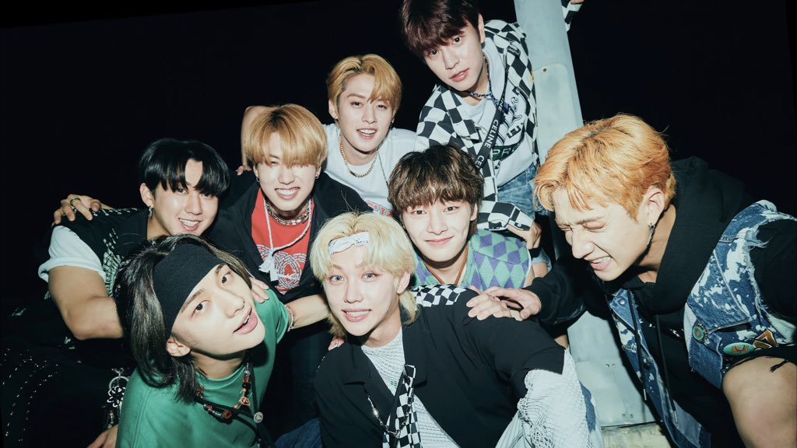



Support Stray Kids comeback to help them get music show wins, awards, and unlock more achievements\~!

Here's a summary of things you may do to support Stray Kids. Please read them all and see what you can do. It may look a lot specially for Baby STAYs but don't worry because Stray Kids fanbases are there to guide you\~! If you have questions about comeback information don't hesitate to reach out to them 🤗

STAYs can contribute for getting **_Music Show Wins_**, charting on **_Billboard_** and more!

# Comeback Detail

**ALBUM:** "MAXIDENT"  
**RELEASE DATE:** October 7 1PM KST | 0AM EST  
**TITLE TRACK:** (TBA)

Visit this website by  for comeback guide and projects.





## Music Show Win

A **_Music Show Win_** happens during their album promotion. The No. 1 song of the week is announced per music show and each music show has different criteria for it. Criteria is usually composed of **YouTube** streaming (FREE), **voting on apps** (FREE), buying **physical album**, and streaming on **Korean streaming platforms** (biggest criteria). We only have few weeks to give Stray Kids Music Show Wins every comeback and there may not be next time for each album that's why STAYs all around the world are encouraged to help participate.

> FREE as long as you have access to internet.

Detailed information about all Korean music shows criteria and schedules are in 

## Billboard

**_Billboard_** tabulates different weekly music charts to see popular music base on album/songs sales and streams from United States and different parts of the world. It is a very popular music chart and Stray Kids charting on it may give them more opportunities.

Here's a   by Billboard SKZ (posted during ODDINARY era).

Follow  and  for _Billboard_ updates and guides for Stray Kids.

# Guide for Sales and Apps

## Korean Digital Sales

Korean digital sale is a BIG part of **_Music Show Win_**. It's also a big factor in **_Award Ceremonies_** (ceremonies to award music, performances, artist of the year and more). To get a big digital sale point, STAYs are encouraged to stream the title track in a playlist and/or download the title track. Download counts as multiple streams. STAYs may stream on **MelOn, Genie, Flo, or Bugs.** Some of it needs verified account but some don't. You may buy your own verified account and streaming pass by yourself or you may stream for **free** by joining a digital streaming team that is funded by STAYs' donations. You may also donate any amount, it will be a big help!

Streaming is not hard! You just have to set your account and settings, make playlist, and leave it play for hours 😁 It's advisable to join a streaming team if it's your first time streaming on Korean platform so the team can guide you.

#### Please donate any amount if you can to trusted streaming teams so we can have funds to buy passes before the release of the album. Sharing the fundraising tweets from fanbases will also help ❤️

For details and inquiries about these streaming platforms, you may reach out to  and follow them for updates.



## Physical Sales

Buying physical albums may count toward 3 different charts: **Hanteo, Circle Chart (formerly Gaon),** and **Billboard**. _Music Show Wins_ and _Korean_ _Award Ceremonies_ uses **Hanteo / Circle Chart** for criteria.

Check out this thread by  to see the list of stores you may pre-order physical album and which chart each store's sale counts. Stores may also have exclusive benefits.



For the album sales it is automatically counted on **Hanteo Chart** when you successfully purchased and shipped your album, the same thing for **Billboard**. **Circle Chart** counts the albums shipped to stores where the albums can be bought.

## Voting

Voting is important to give Stray Kids _Music Show Wins_. It's one of the easiest we can do as a fandom! The platforms we need to make accounts are **Mubeat** (app)**, Idol Champ** (app)**, Freevote** (app)**, and MNET+** (website). Some of it needs to collect points (such as chamsims, heartbeats) to be able to vote.

Follow  and  for music shows, awards, and promotional ads voting updates. You may also visit .

## YouTube Streaming

One of the easiest and free to do is to stream the MV on YouTube. It's advisable to get YouTube Premium for less bot suspicion. You may get a 1 month Premium free trial and make sure to cancel it before the 1 month ends to avoid paying for it after the free trial ends. Streaming without premium is also okay.

There are different methods to stream an MV a lot but the most advisable is doing Manual method.

1. Log in to your YouTube account.
2. Go to the video by doing any of these:
   * Searching with the keyword for example "스트레이 키즈 \[title track\]" or "Stray Kids \[title track\]".
   * Clicking from home page or recommended video.
   * Clicking the shared link of the video.
3. Stream the video with proper setting. Follow do's and don'ts:
   * After watching the video: like, leave a good comment about the MV (don't spam!), and share to your SNS or website.
   * Quality should be at least 480p.
   * Volume should be at least 50%.
   * Speed must be normal.
   * Don't skip time, pause, and replay.
   * Turn off autoplay.
   * If using desktop/laptop don't stream on multiple tabs or windows.
   * If streaming with more than one device, make sure that different accounts are logged in and device are in different IP address.
   * ❗ Avoid using split screen, streaming on background or pop-up screen even with Premium account. This will fall to low quality playback which means the views may be deleted.
4. Stream other videos (fillers) around 3-4 videos with a total of at least 10-min long before you watch the MV again. Example videos are Stray Kids MV, skz-player, skz-record, performances from different channels, etc. Make sure you don't stream the same videos every time you stream in between the MV.
5. Repeat from step 2.

You may see different tutorials on how to do manual streaming but the most important thing is to not let YouTube think you are a robot. The following are my personal tips:

* Interact with good comments every other time. Be careful of bot comments. Make sure the comment are talking about Stray Kids and not a general comment.
* Either skip or don't skip ads but if the ad is the Stray Kids MV do not skip it.
* Don't stream for too long, you may rest after few rounds and then do it again.
* Log in to different accounts.
* Change methods of going to videos (step 2).
* Change number of fillers each round.
* You may either search or click recommendations for the fillers.
* Stream non-kpop videos, if you want to watch a video of a cat or a puppy then go :D

### End note

Those are the basics of supporting Stray Kids mainly to get _Music Show Wins_ and _Billboard_ but also for a chance for them to be nominated on _Award Ceremonies_. There are more things I didn't mentioned here such as other music platforms (Spotify, Apple Music, iTunes etc) but you may see them on SKZ fanbases guides.

Sudden changes may apply so for faster updates and more projects you may follow this Twitter list of . For Instagram you may follow .

Enjoy Stray Kids comeback\~! :wink:

_This post was made to help STAYs visiting this website be aware of Stray Kids comeback. This post was first written during NOEASY era (Aug 2021) and updated every comeback. Some information may have changed without me realizing. It's best to follow Stray Kids fanbase accounts for faster update. You may also DM me at  if information here is outdated, I'll try to update this when I can._