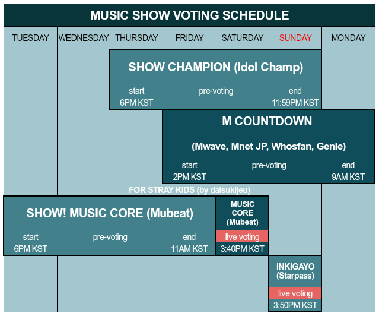



Support Stray Kids comeback to help them get music show wins, awards, and unlock more achievements\~!

# Update

It was said that this special album serves as a gift for STAYs and there's no plan of promoting it on music shows. But we can still achieve a music show win without promotion\~! Let's give more gifts to Stray Kids 😄



# Comeback Detail

**SINGLE:** "Christmas EveL" Holiday Special Single  
**RELEASE DATE:** November 29, 2021 (MON)  
**TITLE TRACKS:** "Christmas EveL" & "Winter Falls"

# What to do?

Here's a summary of things you may do to support Stray Kids. Please read them all and see what you can do. It may look a lot specially for Baby STAYs but don't worry because Stray Kids fanbases are there to guide you. It's easy!

In case you don't know what _Music Show Win_ is, it happens during their album promotion. The No. 1 song of the week is announced per music show and each music show has different criteria for it. Criteria is usually composed of YouTube streaming (FREE), voting on apps (FREE), buying physical album, and streaming on Korean streaming platforms (biggest criteria). We only have few weeks to give Stray Kids Music Show Wins every comeback and there may not be next time for this album that's why STAYs all around the world are encouraged to help participate.

> FREE as long as you have access to internet.

Here's a detailed information about all Korean music shows criteria provided by KShowAnalysis. Stray Kids don't promote and not eligible to win on The Show so you may ignore it. 

## Korean Digital Sales

Korean digital sale is a BIG part of _Music Show Win_. It's also a big factor in _Award Ceremonies_ (ceremonies to award music, performances, artist of the year and more). To get a big digital sale point, STAYs are encourage to stream songs on the following Korean music streaming platforms:

**Mel0n**

* Needs verified account and streaming pass to stream.
* You may buy verified account and streaming pass that are available from third-party sellers or join streaming project to stream free.
* Making unverified account using KKT is possible and it's usable to mass search and like Stray Kids songs (avoid commenting in non-Korean language).
* Counted in all music shows.

**Gen1e**

* Verified and unverified account may stream.
* Needs Korean number to make new account. Accounts are available from third-party sellers.
* Needs streaming pass that is available from third-party sellers or join streaming project to stream free.
* Counted in all music shows.

**Bug$**

* You may make account by yourself.
* You may buy streaming pass by yourself or join streaming project to get free.
* Counted in all music shows except M Countdown.

**FL0**

* Needs verified account and streaming pass to stream.
* You may buy verified account and streaming pass that are available from third-party sellers or join streaming project to stream free.
* Counted in all music shows.

Please consider buying verified account, donate any amount to streaming teams, or apply as volunteer to stream for free. When you already have your account and proper setup for streaming, you may already leave it play for hours. It's easy! For inquiries and more detailed information about Korean music streaming platforms you may reach out to  and follow them for updates.

### Update

Stay Department's donation will be used for next comeback but if you want your donation to be used for Christmas EveL you may contact them. They have an ongoing project to help new streamers be familiar with the streaming platforms.





## Physical Sales

For _Music Show Win_ you need to make sure that you buy albums from stores that counts in **Hanteo** and **Gaon** Chart. It's also a big factor in _Award Ceremonies_.

Here's a list of links where you may pre-order physical albums for "Christmas EveL"



For **Hanteo** when you receive a "Hanteo Authentication Card", don't forget to authenticate your album using Whosfan app for it to count on **Hanteo** Chart. Here's a tutorial on how to authenticate your album:



For _Billboard_, only USA and Puerto Rico STAYs can participate on it. Follow  and  for Billboard guide and updates.

## Voting

Voting is important to give Stray Kids _Music Show Wins_. It's one of the easiest we can do as a fandom!

A guide on where we are going to vote during comeback. Follow  for music shows, awards, and promotional ads voting updates:


A calendar guide of music show voting schedule:

## YouTube Streaming

One of the easiest and free to do is to stream the MV on YouTube. It's advisable to get YouTube Premium so you can stream in background or even when your device screen is off. You may get a 1 month Premium free trial and make sure to cancel it before the 1 month ends to avoid paying for it after the free trial ends. Streaming without premium is also okay.

There are different methods to stream an MV a lot but the most advisable is doing Manual method.

1. Log in to your YouTube account.
2. Go to the video by doing any of these:

* Searching with the keyword for example "스트레이 키즈 \[title track\]" or "Stray Kids \[title track\]".
* Clicking from home page or recommended video.
* Clicking the shared link of the video.

1. Stream the video with proper setting. Follow do's and don'ts:

* After watching the video: like, leave a good comment about the MV (don't spam!), and share to your SNS or website.
* Quality should be at least 480p.
* Volume should be at least 50%.
* Speed must be normal.
* Don't skip time, pause, and replay.
* Turn off autoplay.
* If using desktop/laptop don't stream on multiple tabs.
* If streaming with more than one device, make sure that different accounts are logged in and device are in different IP address.

1. Stream other videos (fillers) around 3-4 videos with a total of at least 10-min long before you watch the MV again. Example videos are Stray Kids MV, skz-player, skz-record, performances from different channels, etc. Make sure you don't stream the same videos every time you stream in between the MV.
2. Repeat from step 2.

You may see different tutorials on how to do manual streaming but the most important thing is to not let YouTube think you are a robot. The following are my personal tips:

* Interact with comments every other time.
* Either skip or don't skip ads but if the ad is the Stray Kids MV do not skip it.
* Don't stream for too long, you may rest after few rounds and then do it again.
* Log in to different accounts.
* Change methods of going to videos (step 2).
* Change number of fillers each round.
* You may either search or click recommendations for the fillers.
* Stream non-kpop videos, if you want to watch a video of a cat or a puppy then go :D

### End note

Those are the basics of supporting Stray Kids mainly to get _Music Show Wins_ but also for a chance for them to be nominated on _Award Ceremonies_. There's more we may do to help Stray Kids get more achievements and recognition such as helping with Billboard, international iTunes, Spotify, etc. but I will add those on a different post if this post got engagements.

Sudden changes may apply so for faster updates and more projects you may follow this Twitter list of . For Instagram you may follow .

Enjoy Stray Kids comeback\~! :wink:

_This post was made to help STAYs visiting this website be aware of Stray Kids comeback. This post was first written during NOEASY era (Aug 2021) and updated some information for Christmas EveL. Some information may have changed without me realizing but it's pretty much the same every comeback. It's best to follow Stray Kids fanbase accounts for faster update._